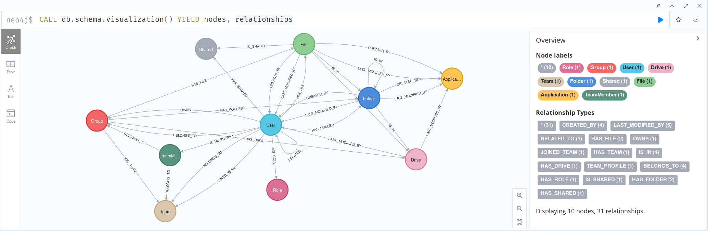

# AADInternals
AADInternals is PowerShell module for administering Azure AD and Office 365

For details, please visit https://aadinternals.com/aadinternals

Load module:
```powershell
Import-Module .\AADInternals\AADInternals.psd1 -Force
```

If you add new function you have to add them in `AADInternals.psd1` before importing the module.

### Full workflow for extracting shared documents and messages

```powershell
Import-Module .\AADInternals -Force
# get a privileged token to be able to access other services
Get-AADIntAccessTokenForAzureCoreManagement -SaveToCache -UseDeviceCode
# get a token for the graph API using the privileged token
Get-AADIntAccessTokenFromCacheRefreshToken -Resource "https://management.core.windows.net/" -ClientId "d3590ed6-52b3-4102-aeff-aad2292ab01c" -NewResource "https://graph.microsoft.com" -SaveToCache 
# set the access token parameter
$AccessToken = Get-AADIntAccessTokenFromCache -Resource "https://graph.microsoft.com" -ClientId "d3590ed6-52b3-4102-aeff-aad2292ab01c"
# get all the groups files' download URLs (shared documents in any channels)
# The items returned by Get-MSGraphPersonalDriveItemsContent don't appear.
$data = Get-AADIntMSGraphGroupsDriveItemsContent -AccessToken $AccessToken
$data.'@microsoft.graph.downloadUrl'
# get all the current user files' download URLs
$data = Get-AADIntMSGraphPersonalDriveItemsContent -AccessToken $AccessToken
$data.'@microsoft.graph.downloadUrl'
# download all the accessible files in .\Files\
Get-AADIntMSGraphFiles -AccessToken $AccessToken -Destination .\Files\
# export all the accessible data in .\Files\
Export-AADIntAzureADToCSV -AccessToken $AccessToken -Directory .\Files\
# get a token for the skype API using the privileged token
Get-AADIntAccessTokenFromCacheRefreshToken -Resource "https://management.core.windows.net/" -ClientId "d3590ed6-52b3-4102-aeff-aad2292ab01c" -NewResource "https://api.spaces.skype.com" -SaveToCache
# set the access token parameter
$AccessToken = Get-AADIntAccessTokenFromCache -Resource "https://api.spaces.skype.com" -ClientId "d3590ed6-52b3-4102-aeff-aad2292ab01c"
# get all the teams messages
Get-AADIntTeamsMessages -AccessToken $AccessToken
```

### Teams messages workflow

Using a privileged token :
```powershell
# get the privileged token, we'll use it's ClientId for requesting new tokens
Get-AADIntAccessTokenForAzureCoreManagement -SaveToCache -UseDeviceCode
# get the Resource and ClientId from the cache
Get-AADIntCache
# request a token for teams and save it to the cache
Get-AADIntAccessTokenFromCacheRefreshToken -Resource "https://management.core.windows.net/" -ClientId "d3590ed6-52b3-4102-aeff-aad2292ab01c" -NewResource "https://api.spaces.skype.com" -SaveToCache
# set the access token parameter
$AccessToken = Get-AADIntAccessTokenFromCache -Resource "https://api.spaces.skype.com" -ClientId "d3590ed6-52b3-4102-aeff-aad2292ab01c"
# use the teams token
Get-AADIntTeamsMessages -AccessToken $AccessToken
```

### List the groups, directory roles, and administrative units that the user is a direct member of.

```powershell
# get a privileged token to be able to access other services
Get-AADIntAccessTokenForAzureCoreManagement -SaveToCache -UseDeviceCode
# get a token for the graph API using the privileged token
Get-AADIntAccessTokenFromCacheRefreshToken -Resource "https://management.core.windows.net/" -ClientId "d3590ed6-52b3-4102-aeff-aad2292ab01c" -NewResource "https://graph.microsoft.com" -SaveToCache 
# set the access token parameter
$AccessToken = Get-AADIntAccessTokenFromCache -Resource "https://graph.microsoft.com" -ClientId "d3590ed6-52b3-4102-aeff-aad2292ab01c"
# get the current user groups, directory roles, and administrative units
Get-AADIntMSGraphPersonalMemberOf -AccessToken $AccessToken
# get the users ids
$(Get-AADIntMSGraphUsers -AccessToken $AccessToken).id
# get an user groups, directory roles, and administrative units
Get-AADIntMSGraphUserMemberOf -AccessToken $AccessToken -UserId 64d999db-fc15-459c-bccf-5fa5908557aa
# get the users having a specific role
Get-AADIntMSGraphRoleMembers -AccessToken $AccessToken -RoleId 40edd42d-2b58-4f1b-a628-d99eac621948
```

### List the teams joined by a user, people linked to a user and documents shared by a user

```powershell
# get a privileged token to be able to access other services
Get-AADIntAccessTokenForAzureCoreManagement -SaveToCache -UseDeviceCode
# get a token for the graph API using the privileged token
Get-AADIntAccessTokenFromCacheRefreshToken -Resource "https://management.core.windows.net/" -ClientId "d3590ed6-52b3-4102-aeff-aad2292ab01c" -NewResource "https://graph.microsoft.com" -SaveToCache 
# set the access token parameter
$AccessToken = Get-AADIntAccessTokenFromCache -Resource "https://graph.microsoft.com" -ClientId "d3590ed6-52b3-4102-aeff-aad2292ab01c"
# get the user identifier
Get-AADIntMSGraphUsers -AccessToken $AccessToken
# get the teams joined by an user, if the user is an unprivileged user you get (403) Forbidden
Get-AADIntMSGraphJoinedTeams -AccessToken $AccessToken -UserId 64d999db-fc15-459c-bccf-5fa5908557aa
# get the people linked to the user
Get-AADIntMSGraphPeople -AccessToken $AccessToken -UserId 64d999db-fc15-459c-bccf-5fa5908557aa
# get the documents shared by the user (supported only for the current user for now)
Get-AADIntMSGraphShared -AccessToken $AccessToken -UserId 64d999db-fc15-459c-bccf-5fa5908557aa | Format-List
```

### List the group members and owners

```powershell
# get a privileged token to be able to access other services
Get-AADIntAccessTokenForAzureCoreManagement -SaveToCache -UseDeviceCode
# get a token for the graph API using the privileged token
Get-AADIntAccessTokenFromCacheRefreshToken -Resource "https://management.core.windows.net/" -ClientId "d3590ed6-52b3-4102-aeff-aad2292ab01c" -NewResource "https://graph.microsoft.com" -SaveToCache 
# set the access token parameter
$AccessToken = Get-AADIntAccessTokenFromCache -Resource "https://graph.microsoft.com" -ClientId "d3590ed6-52b3-4102-aeff-aad2292ab01c"
# get the group identifier
Get-AADIntMSGraphGroups -AccessToken $AccessToken
# get the group members
Get-AADIntMSGraphGroupMembers -AccessToken $AccessToken -GroupId aa9ea6fd-6b09-4b70-9ba6-34551068a8d0
# get the group owner
Get-AADIntMSGraphGroupOwners -AccessToken $AccessToken -GroupId aa9ea6fd-6b09-4b70-9ba6-34551068a8d0
```

### List the information of a team 

```powershell
# get a privileged token to be able to access other services
Get-AADIntAccessTokenForAzureCoreManagement -SaveToCache -UseDeviceCode
# get a token for the graph API using the privileged token
Get-AADIntAccessTokenFromCacheRefreshToken -Resource "https://management.core.windows.net/" -ClientId "d3590ed6-52b3-4102-aeff-aad2292ab01c" -NewResource "https://graph.microsoft.com" -SaveToCache 
# set the access token parameter
$AccessToken = Get-AADIntAccessTokenFromCache -Resource "https://graph.microsoft.com" -ClientId "d3590ed6-52b3-4102-aeff-aad2292ab01c"
# get the group identifier
Get-AADIntMSGraphGroupsWithTeam -AccessToken $AccessToken
# get the teams information. it return (404) Not Found if the group is not a team.
Get-AADIntMSGraphTeam -AccessToken $AccessToken -GroupId aa9ea6fd-6b09-4b70-9ba6-34551068a8d0
```

### Loading a token from the cache

```powershell
# returns the Resource and ClientId strings for querying the token value
Get-AADIntCache
# get a teams access token
Get-AADIntAccessTokenFromCache -Resource "https://api.spaces.skype.com" -ClientId "1fec8e78-bce4-4aaf-ab1b-5451cc387264" -IncludeRefreshToken 
```

## Useful resources

If an access token is returned, `scope` lists the scopes the access token is valid for. 

**It is not related to the user's permissions.**
Any user (guest, member or admin) has the same scope for a given resource.

For instance scope with `Get-AADIntAccessTokenForMSGraph -SaveToCache -UseDeviceCode`.
```powershell
scope : Agreement.Read.All Agreement.ReadWrite.All AgreementAcceptance.Read AgreementAcceptance.Read.All AuditLog.Read.All Directory.AccessAsUser.All Directory.ReadWrite.All Group.ReadWrite.All IdentityProvider.ReadWrite.All Policy.ReadWrite.TrustFramework PrivilegedAccess.ReadWrite.AzureAD PrivilegedAccess.ReadWrite.AzureADGroup PrivilegedAccess.ReadWrite.AzureResources TrustFrameworkKeySet.ReadWrite.All User.Invite.All
```

---

_Device code flow with resource-based permissions._

---

The Microsoft identity platform supports two types of permissions: **delegated permissions** and application permissions.
- **Delegated permissions** are used by apps that have a signed-in user present. For these apps, either the user or an administrator consents to the permissions that the app requests. The app is delegated with the permission to act as a signed-in user when it makes calls to the target resource.

    Some delegated permissions can be consented to by nonadministrators. But some high-privileged permissions require administrator consent.

- Application permissions are used by apps that run without a signed-in user present, for example, apps that run as background services or daemons. Only an administrator can consent to application permissions.

**Effective permissions** are the permissions that your app has when it makes requests to the target resource. It's important to understand the difference between the delegated permissions and application permissions that your app is granted, and the effective permissions your app is granted when it makes calls to the target resource.

- For **delegated permissions**, the effective permissions of your app are the _least-privileged intersection of the delegated permissions the app has been granted (by consent) and the privileges of the currently signed-in user_. **Your app can never have more privileges than the signed-in user**.

    Within organizations, the privileges of the signed-in user can be determined by policy or by membership in one or more administrator roles.

    For example, assume your app has been granted the User.ReadWrite.All delegated permission. This permission nominally grants your app permission to read and update the profile of every user in an organization. If the signed-in user is a global administrator, your app can update the profile of every user in the organization. However, if the signed-in user doesn't have an administrator role, your app can update only the profile of the signed-in user. It can't update the profiles of other users in the organization because the user that it has permission to act on behalf of doesn't have those privileges.

- For application permissions, the effective permissions of your app are the full level of privileges implied by the permission. For example, an app that has the User.ReadWrite.All application permission can update the profile of every user in the organization.

### Links

- [Configuring optional claims](https://docs.microsoft.com/en-us/azure/active-directory/develop/active-directory-optional-claims#configuring-optional-claims)
- [Microsoft identity platform and the OAuth 2.0 device authorization grant flow](https://docs.microsoft.com/en-us/azure/active-directory/develop/v2-oauth2-device-code)
- [Microsoft identity platform access tokens](https://docs.microsoft.com/en-us/azure/active-directory/develop/access-tokens)
- [Guest, User, Admin](https://o365blog.com/aadkillchain/)
- [Permissions reference](https://docs.microsoft.com/en-us/graph/permissions-reference)
- [Scopes and permissions](https://docs.microsoft.com/en-us/azure/active-directory/develop/v2-permissions-and-consent#scopes-and-permissions)
- [Permission types](https://docs.microsoft.com/en-us/azure/active-directory/develop/v2-permissions-and-consent#permission-types)
- [Admin-restricted permissions](https://docs.microsoft.com/en-us/azure/active-directory/develop/v2-permissions-and-consent#admin-restricted-permissions)
- [Compare member and guest default permissions](https://docs.microsoft.com/en-us/azure/active-directory/fundamentals/users-default-permissions#compare-member-and-guest-default-permissions)
- [Least privileged roles by task in Azure Active Directory](https://docs.microsoft.com/en-us/azure/active-directory/roles/delegate-by-task)
- [team resource type](https://github.com/microsoftgraph/microsoft-graph-docs/blob/main/api-reference/beta/resources/team.md), [teamVisibilityType](https://github.com/microsoftgraph/microsoft-graph-docs/blob/main/api-reference/beta/resources/teamvisibilitytype.md)

## Neo4j visualization

After exporting all available data in CSV format, it is possible to import them directly into a Neo4j database for easy visualization of the target infrastructure.
Below is the resulting node and relationship diagram :


### CSV export
The easiest way is to export everything :
```powershell
# export all the accessible data in .\Files\
Export-AADIntAzureADToCSV -AccessToken $AccessToken -Directory .\Files\
```

Otherwise you can choose specific data to export :
```powershell
Get-AADIntMSGraphUsers -AccessToken $AccessToken | 
    ConvertTo-AADIntUser |
    Export-Csv -NoTypeInformation -Path users.csv -Encoding UTF8
Get-AADIntMSGraphTeam -AccessToken $AccessToken -GroupId aa9ea6fd-6b09-4b70-9ba6-34551068a8d0 | 
    ConvertTo-AADIntTeam |
    Export-Csv -NoTypeInformation -Path team.csv -Encoding UTF8
Get-AADIntMSGraphTeamMembers -AccessToken $AccessToken -GroupId aa9ea6fd-6b09-4b70-9ba6-34551068a8d0 | 
    ConvertTo-AADIntTeamMember |
    Export-Csv -NoTypeInformation -Path team_members.csv -Encoding UTF8
# Get-AADIntMSGraphJoinedTeams -UserId ""
Get-AADIntMSGraphPersonalJoinedTeams -AccessToken $AccessToken | 
    ConvertTo-AADIntJoinedTeam |
    Export-Csv -NoTypeInformation -Path personal_joinedteams.csv -Encoding UTF8
# Get-AADIntMSGraphShared -UserId ""
Get-AADIntMSGraphPersonalShared -AccessToken $AccessToken | 
    ConvertTo-AADIntShared |
    Export-Csv -NoTypeInformation -Path personal_shared.csv -Encoding UTF8
# Get-AADIntMSGraphPeople -UserId ""
Get-AADIntMSGraphPersonalPeople -AccessToken $AccessToken | 
    ConvertTo-AADIntPeople |
    Export-Csv -NoTypeInformation -Path personal_people.csv -Encoding UTF8
# Get-AADIntMSGraphUser -UserId ""
# Get-AADIntMSGraphPersonalUser
# Get-AADIntMSGraphGroupOwners -GroupId ""
# Get-AADIntMSGraphRoleMembers -RoleId ""
Get-AADIntMSGraphGroupMembers -AccessToken $AccessToken -GroupId 2c150da4-603f-4348-a886-624f8aaf4b49 | 
    ConvertTo-AADIntUser |
    Export-Csv -NoTypeInformation -Path group_members.csv -Encoding UTF8
# Get-AADIntMSGraphGroups, @odata.type not present
# Get-AADIntMSGraphUserMemberOf -UserId "" 
# Get-AADIntMSGraphUserTransitiveMemberOf -UserId "" 
Get-AADIntMSGraphPersonalMemberOf -AccessToken $AccessToken | 
    ConvertTo-AADIntGroup |
    Export-Csv -NoTypeInformation -Path personal_memberof.csv -Encoding UTF8
# Get-AADIntMSGraphGroupRootFolder -GroupId ""
Get-AADIntMSGraphPersonalRootFolder -AccessToken $AccessToken | 
    ConvertTo-AADIntGroupRootDrive |
    Export-Csv -NoTypeInformation -Path personal_rootfolder.csv -Encoding UTF8
Get-AADIntMSGraphGroupDrives -GroupId "aa9ea6fd-6b09-4b70-9ba6-34551068a8d0" -AccessToken $AccessToken | 
    ConvertTo-AADIntGroupDrive |
    Export-Csv -NoTypeInformation -Path group_drives.csv -Encoding UTF8
# Get-AADIntMSGraphGroupDriveItems -GroupId "" -DriveId ""
Get-AADIntMSGraphPersonalDriveItems -DriveId "017F7BVQF6Y2GOVW7725BZO354PWSELRRZ" -AccessToken $AccessToken | 
    ConvertTo-AADIntGroupDriveItem |
    Export-Csv -NoTypeInformation -Path personal_driveitems.csv -Encoding UTF8
# Get-AADIntMSGraphGroupDriveItemsContent -GroupId ""
# Get-AADIntMSGraphGroupsDriveItemsContent
# Get-AADIntMSGraphSharedResource -SharedInsightId ""
Get-AADIntMSGraphPersonalDriveItemsContent -AccessToken $AccessToken | 
    ConvertTo-AADIntGroupDriveItemContent |
    Export-Csv -NoTypeInformation -Path personal_driveitemscontent.csv -Encoding UTF8
```

### Neo4j import

When the CSV files are generated, it is necessary to place them in the import folder of Neo4j - `/var/lib/neo4j/import` for instance. See [File locations](https://neo4j.com/docs/operations-manual/current/configuration/file-locations/) for more informations.

You'll need to install `apoc` to be able to clear the database. See [APOC Core Installation](https://neo4j.com/labs/apoc/4.1/installation/#apoc-core). Then you'll have to set `dbms.security.procedures.unrestricted=apoc.*` in `/etc/neo4j/neo4j.conf`.

Use the bash script `import.sh`. Execute first with `--setup-database` to create the indexes and constraints. 

`./import.sh -u <username> -p <password> --setup-database --import`

```bash
Import CSV files extracted from AADInternals into Neo4j

usage: ./import.sh --username string --password string [--directory cypher/ --setup-database --clear-database]

  --username,-u string    username of the Neo4j database
  --password,-p string    password of the Neo4j database
  --directory,-d string   (Optional) directory with the .cypher scripts
  --import                (Optional) import all the files into the database
  --setup-database        (Optional) create the indexes and constraints
  --clear-database        (Optional) clear the database content, indexes and constraints
```

### Cypher queries

If you are seeing relationships in the Neo4j browser you can turn off "Auto-Complete" - look in the bottom right for the toggle. By default relationships between nodes returned in the browser are shown in the visual, even if not returned in the query.

```cypher
// Return all the drives tree
MATCH p=(:Folder {name: "root"})-[:IS_IN]->(:Drive)
MATCH q=(:Folder)-[:IS_IN]->(:Folder) 
MATCH r=(:File)-[:IS_IN]->(:Folder) 
RETURN p, q, r LIMIT 100
```

```cypher
// Return the drives tree of a specific group
MATCH p=(g:Group {displayName: "TEST1"})-[:HAS_DRIVE]->(:Drive)<-[:IS_IN]-(rootFolder:Folder {name: "root"})
OPTIONAL MATCH (g)-[:HAS_FOLDER]->(f1:Folder)-[r1:IS_IN]->(f2:Folder)
OPTIONAL MATCH (g)-[:HAS_FILE]->(f3:File)-[r2:IS_IN]->(f4:Folder) 
RETURN p, f1, r1, f2, f3, r2, f4 LIMIT 100
```

```cypher
// Return the drives that are not linked to any group (like the personal drive)
MATCH (d:Drive)
WHERE NOT (:Group)-[:HAS_DRIVE]-(d)
RETURN d
```

```cypher
// Return all the files of an user or a group
MATCH p=()-[:HAS_FILE]->(:File)
RETURN p LIMIT 50
```

```cypher
// Return the files created after a specific date
// The same can be done for the nodes :
// - Group (createdDateTime, renewedDateTime, expirationDateTime)
// - Team (createdDateTime)
// - AuditLog (activityDateTime)
// - User (onPremisesLastSyncDateTime, refreshTokensValidFromDateTime, signInSessionsValidFromDateTime)
// - File (createdDateTime, lastModifiedDateTime)
// - Folder (createdDateTime, lastModifiedDateTime)
// - Drive (createdDateTime, lastModifiedDateTime)
// - Shared (sharedDateTime)
// - Role (deletedDateTime)
// - ServicePrincipal (deletedDateTime, createdDateTime, verifiedPublisherAddedDateTime)
// - TeamMember (visibleHistoryStartDateTime)
// and the relationships :
// - ASSIGNED_TO (createdDateTime)
WITH datetime({year: 2022, month: 6, day: 1}) AS limitDate
MATCH (f:File) WHERE f.createdDateTime >= limitDate 
RETURN f
```

```cypher
// Return all the users role
MATCH p=(:User)-[:HAS_ROLE]->(:Role) 
RETURN p LIMIT 50
```

```cypher
// Return the users having shared a document
MATCH p=(:File)-[:IS_SHARED]->(:Shared)
MATCH q=(:User)-[:HAS_SHARED]->(:Shared) 
RETURN p, q LIMIT 50
```

```cypher
// Return the joined teams
MATCH p=(:User)-[:JOINED_TEAM]->(:Team) 
RETURN p LIMIT 50
```

```cypher
// Return the teams owner
MATCH p=(:TeamMember {roles: "owner"})-[:BELONGS_TO]->(:Team) 
RETURN p LIMIT 50
```

```cypher
// Return the teams user count
MATCH (t:Team) 
RETURN 
    t.summaryGuestsCount as guestsCount, 
    t.summaryMembersCount as membersCount, 
    t.summaryOwnersCount as ownersCount LIMIT 50
```

```cypher
// Return the groups with a team
MATCH p=(:Group)-[:HAS_TEAM]->(:Team) 
RETURN p LIMIT 50
```

```cypher
// Return the group owners
MATCH p=(:User)-[:OWNS]->(:Group) 
RETURN p LIMIT 50
```

```cypher
// Return the users related to someone with a relevance score higher than 7
MATCH p=(:User {displayName: "Nicolas"})-[r:RELATED_TO]->(:User) 
WHERE r.relevanceScore > 7.0
RETURN p LIMIT 25
```

```cypher
// Return the groups related to someone with a relevance score higher than 7
MATCH p=(:User {displayName: "Nicolas"})-[r:RELATED_TO]->(:Group) 
WHERE r.relevanceScore > 7.0
RETURN p LIMIT 25
```

```cypher
// Return the documents created by an user
MATCH p=()-[:CREATED_BY]->(:User {displayName: "Support"})
RETURN p LIMIT 25
```

```cypher
// Return the documents created by an application
MATCH p=()-[:CREATED_BY]->(:Application)
RETURN p LIMIT 25
```

```cypher
// Return the documents last modified by an user
MATCH p=()-[:LAST_MODIFIED_BY]->(:User {displayName: "Support"})
RETURN p LIMIT 25
```

```cypher
// Return the documents last modified by an application
MATCH p=()-[:LAST_MODIFIED_BY]->(:Application)
RETURN p LIMIT 25
```

```cypher
// Return the target resources of an audit log
MATCH p=(:AuditLog {activityDisplayName: "Add app role assignment grant to user"})-[:TARGET_RESOURCE]->(:AuditLogTargetResource)
RETURN p LIMIT 100
```

```cypher 
// Return the audit log targeting an user
MATCH p=(:AuditLog)-[:TARGET_RESOURCE]->(:AuditLogTargetResource {type: "User"})
RETURN p LIMIT 100
```

```cypher 
// Return the audit log targeting a service principal
MATCH p=(:AuditLog)-[:TARGET_RESOURCE]->(:AuditLogTargetResource {type: "ServicePrincipal"})
RETURN p LIMIT 100
```

```cypher
// Return a specific audit log target resources modified properties
// "Remove delegated permission grant"
// "Add delegated permission grant"
// "Add app role assignment grant to user"
// "Consent to application"
// "Update user"
MATCH (t:AuditLogTargetResource)<-[r1:TARGET_RESOURCE]-(a:AuditLog {activityDisplayName: "Add app role assignment grant to user"})-[:MODIFIED_PROPERTY]->(m:AuditLogTargetResourceModifiedProperty)
OPTIONAL MATCH (t)-[r2:MODIFIED_PROPERTY]->(m)
RETURN t, r1, a, r2, m LIMIT 200
```

```cypher
// Return the audit log initiated by a specific user
MATCH (a:AuditLog {initiatedByUserUserPrincipalName: "nicolas@onmicrosoft.com"})
RETURN a LIMIT 200
```

```cypher
// Return the audit log that are not successful
MATCH (a:AuditLog)
WHERE NOT a.result = "success"
RETURN a LIMIT 200
```

```cypher
// Return the delegated permissions granted by a specific user
MATCH p=(:User {userPrincipalName: "nicolas@onmicrosoft.com"})-[:GRANTED_PERMISSION]->(:DelegatedPermissionGrant)<-[:HAS_DELEGATED_PERMISSION]-(:ServicePrincipal)
RETURN p LIMIT 200
```

```cypher
// Return the application roles and permission scopes of a service principal (application)
MATCH p=(:AppRole)<-[:APPLICATION_ROLE]-(:ServicePrincipal {displayName: "Microsoft Teams Retail Service"})-[:PERMISSION_SCOPE]->(:PermissionScope)
RETURN p LIMIT 200
```

```cypher
// Return the tenants, use it before looking for the tenant registered applications
MATCH (t:Tenant) RETURN t LIMIT 25
```

```cypher
// Return the application roles assigned to an user
// If the resource application has not declared any app roles, a default app role ID of 00000000-0000-0000-0000-000000000000 
// can be specified to signal that the principal is assigned to the resource app without any specific app roles.
// See https://docs.microsoft.com/en-us/graph/api/resources/approleassignment?view=graph-rest-1.0#properties=
MATCH p=(:ServicePrincipal)<-[:ASSIGNED_FOR]-(:AppRoleAssignment)<-[:ASSIGNMENT]-(:AppRole)-[r:ASSIGNED_TO]->(:User)
RETURN p LIMIT 100
```

```cypher
// Return the application roles assigned to a group
// If the resource application has not declared any app roles, a default app role ID of 00000000-0000-0000-0000-000000000000 
// can be specified to signal that the principal is assigned to the resource app without any specific app roles.
// See https://docs.microsoft.com/en-us/graph/api/resources/approleassignment?view=graph-rest-1.0#properties=
MATCH p=(:ServicePrincipal)<-[:ASSIGNED_FOR]-(:AppRoleAssignment)<-[:ASSIGNMENT]-(:AppRole)-[r:ASSIGNED_TO]->(:Group)
RETURN p LIMIT 100
```


